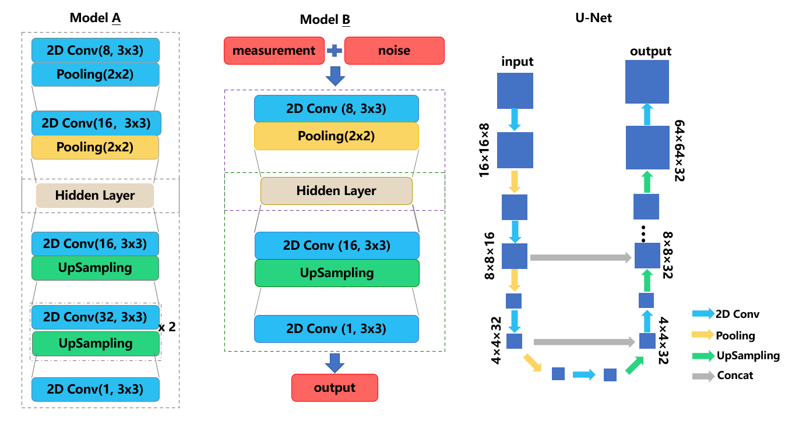

# EIT-cdae-algorithm

This repository contains: 

1) The models for EIT image reconstruction which is published in [EIT-CDAE](https://ieeexplore.ieee.org/document/8918979) and follow-up work.

2) Database constructed for training.

## Table of Contents

* [EIT-image-reconstruction models](#Models)
  * [Dataset-preparation](#Dataset-preparation)
  
  * [Train](#Train)
  * [Performance](#Performance)
* [Author](#Author)
* [License](#license)

## Models

The architecture of EIT image reconstruction networks, which contains: EIT-CDAE(model A), network to denoise measurement matrix(model B) and U-net for EIT image reconstruction. 

## Dataset-generation

There are 2 choices of datasets: using open-source dataset: [montreal dataset](http://eidors3d.sourceforge.net/data_contrib/evaluation-phantom/phantom_evaluation.shtml) of EIDORS or generate simulated dataset. Both need  to use [EIDORS](#eidors3d.sourceforge.net/) toolkit. To generate the dataset, you need run data_gen.m in dataset file. An instance of images processed is as below:


## Train

The CDAE-EIT model was built using Tensorflow, please read detail in

```
code/cdae.py
```

 The network to denoise measurement matrix(model B) was built using Tensorflow. This model using measurement matrix from open-source dataset with additional noise as input, original data as output. Then the denoised data can be used to reconstruct EIT images. Please read details in 

```
code/matricDN.py
```

U-net for EIT image reconstruction was built using Tensorflow, details in:

```
code/U-net.py
```

## Performance

- CDAE：

  1. Train and test the CDAE model with constructed database. The reconstructed images are as following:


​		2. Testing results of the model with open-source database: Montreal database: 


- results of  the matrix denoise model :


​		(a): Original image; (b) Image with additional noise; (c): Results of the model's output 

- U-net

  ​	1. Results of constructed database


​		2. Results of open-source database


## Authors

* **Yue Gao** 
* **Yewangqing Lu**
* **Hui Li**
* **Boxiao Liu**
* **Mingyi Chen**
* **Guoxing Wang**
* **Yong Lian**
* **Yongfu Li***

## License

Please cite these papers if you have used part of this work.

```
GAO Y, LU Y, LI H, et al. EIT-CDAE: a 2-D electrical impedance tomography image reconstruction method based on auto encoder technique[C]. IEEE Biomedical Circuits & Systems Conference, 2019: 1-4.
GAO Y, LIU B, LI H, et al. Live Demonstration: a pulmonary conditions monitor based on electrical impedance tomography measurement[C]. International Symposium on Circuits and Systems, 2019: 1-1.
```